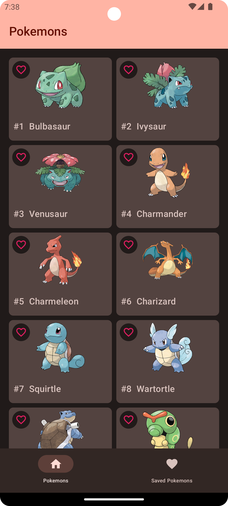
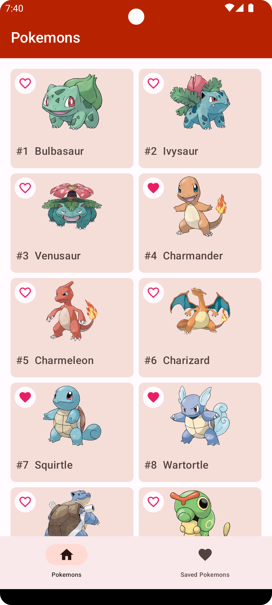
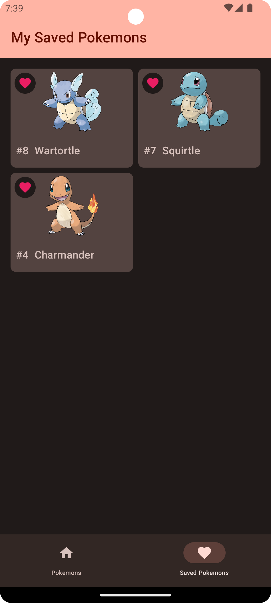
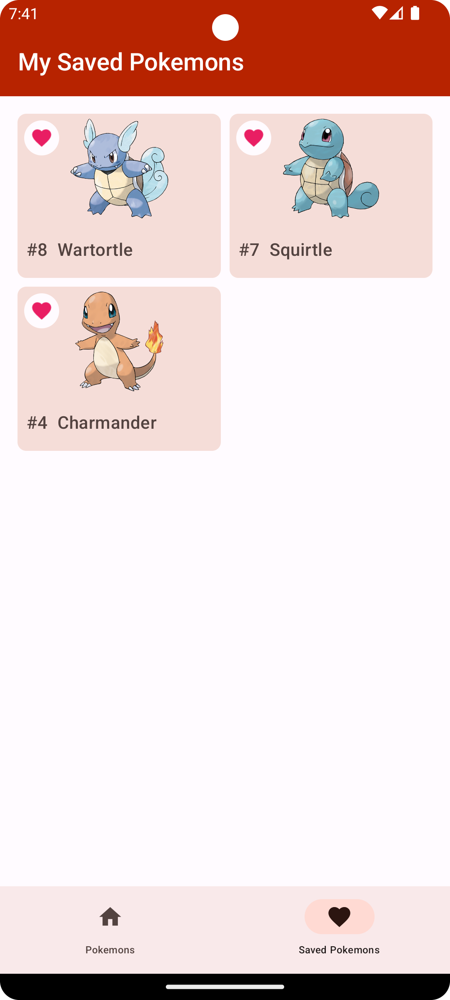
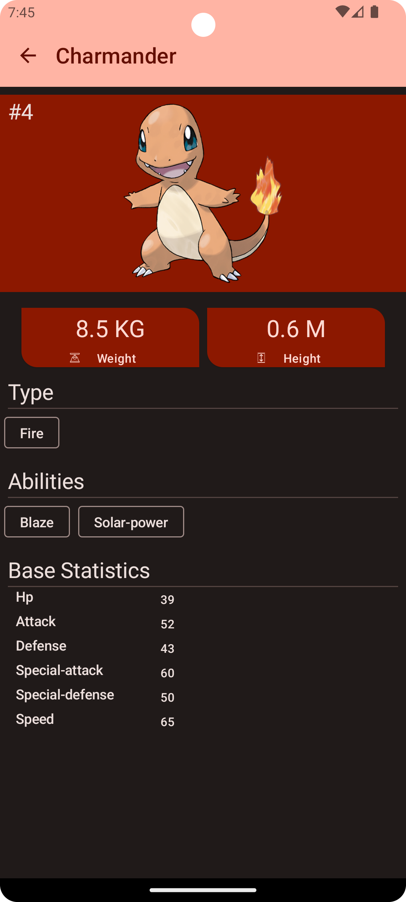
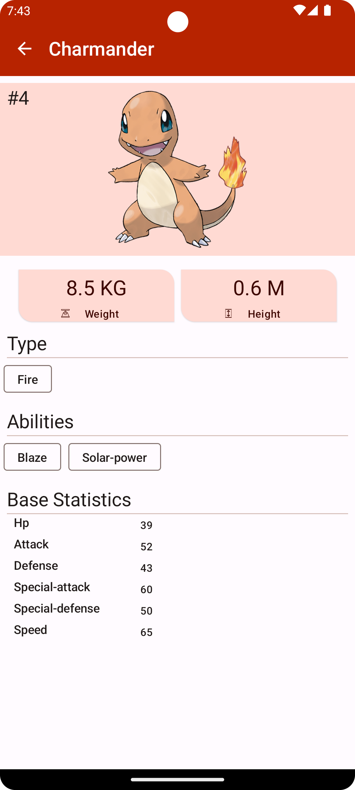
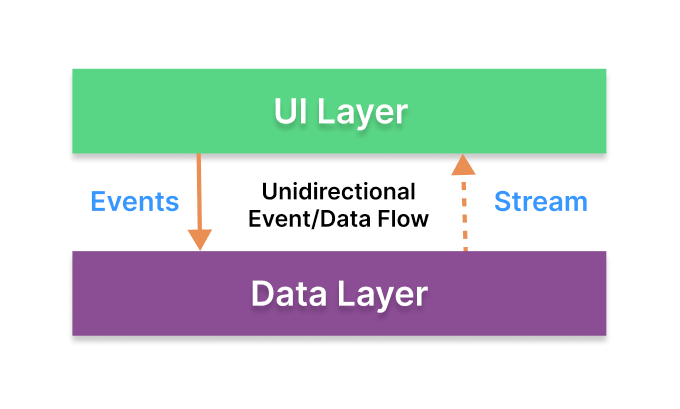
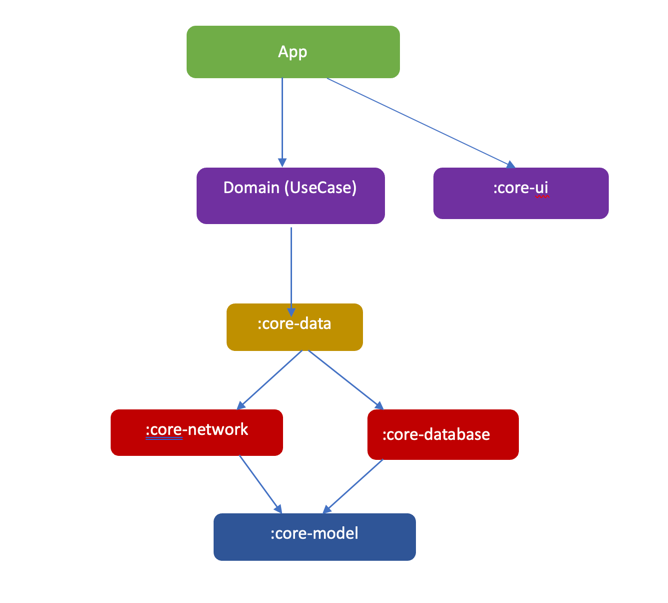

# Mini Pokedex
<br/>

[](https://opensource.org/licenses/Apache-2.0) [](https://android-arsenal.com/api?level=23)
<br/>
Mini Pokedex is a android app that uses [Pokémon API](https://pokeapi.co/) to show a list of Pokémons and their characteristics 

✨Application Features:
--------------
- View a list of the first 100 Pokémon
- Able to save Pokémon as favorite
- View more info about Pokémon and its basics stats

## Todo
- Increase the test coverage 
- Add static code analysis
- Add CI/CD

# [Screenshots 📱](screenshots)


|                          Home       (Dark Theme)                          |                            Home  (Light Theme)                             |
|:-------------------------------------------------------------------------:|:--------------------------------------------------------------------------:|
|  |  |

|                        Saved Pokémon  (Dark Theme)                         |                                (Light Theme)                                |
|:--------------------------------------------------------------------------:|:---------------------------------------------------------------------------:|
|  |  |

|                      Pokémon info       (Dark Theme)                       |                                (Light Theme)                                |
|:--------------------------------------------------------------------------:|:---------------------------------------------------------------------------:|
|  |  |


## Tech-stack used 🛠
| **Tech Tools**                                                                    | **Usage/Purpose**                                          |
|-----------------------------------------------------------------------------------|------------------------------------------------------------|
| [Kotlin](https://github.com/JetBrains/kotlin)                                     | Language                                                   |
| [Jetpack Compose](https://developer.android.com/jetpack/compose)                  | UI creation library                                        |
| [Compose Navigation](https://developer.android.com/jetpack/compose/navigation)    | Navigate between Compose Screen                            |
| [Compose Paging](https://developer.android.com/jetpack/androidx/releases/paging)  | Managing multiple pages of data                            |
| [Coil](https://coil-kt.github.io/coil/)                                           | 🖼️ Image Loading Library                                  |
| [Coroutines](https://kotlinlang.org/docs/coroutines-overview.html)                | 🧵 Asynchronous Programming                                |
| [StateFlow](https://developer.android.com/kotlin/flow/stateflow-and-sharedflow)   | Observable Data and state holder                           |
| [Dependency injection with Hilt](https://dagger.dev/hilt/)                        | 💉 Dependency Injection Library                            |
| [Retrofit](https://square.github.io/retrofit/)                                    | 🌐 Used for Networking                                     |
| [OkHTTP](https://square.github.io/okhttp/)                                        | 🌐 HTTP Client required by Retrofit Library for Networking |
| [Kotlinx Serialization](https://github.com/Kotlin/kotlinx.serialization)          | 🌐 Use to serialize and deserialize Kotlin objects to JSON |
| [Kotlin Gradle](https://kotlinlang.org/docs/gradle-configure-project.html)        | ⚙️ All the gradle files are written in pure kotlin         |
| [AndroidX](https://developer.android.com/jetpack/androidx)                        | Android library for core functionalities                   |
| [ViewModel](https://developer.android.com/topic/libraries/architecture/viewmodel) | Manage data and UI State in lifecycle-aware fashion        |
| [Room DB](https://developer.android.com/topic/libraries/architecture/room)        | 💾  For local data storage                                 |


_**Testing**_ <br/>

| **Testing Tools**                             | **Usage/Purpose** |
|-----------------------------------------------|-------------------|
| [Junit](https://junit.org/junit4/)            | Unit Testing      |
| [Mockk](https://mockk.io/)                    | Data Mocking      |
| [Truth](https://truth.dev/)                   | Unit Testing      |
| [Turbine](https://github.com/cashapp/turbine) | Flow Testing      |

_Other Tools/Project setup_ <br/>

| **Tools**                                                                            | **Usage/Purpose**                                                                      |
|--------------------------------------------------------------------------------------|----------------------------------------------------------------------------------------|
| [Gradle secrets plugin](https://github.com/google/secrets-gradle-plugin)             | A Gradle plugin for providing your secrets to your Android project                     |
| [Hilt(DI)](https://developer.android.com/training/dependency-injection/hilt-android) | Dependency Injection Library                                                           |
| [Kotlin Symbol Processing (KSP)](https://developer.android.com/build/migrate-to-ksp) | code generation  for Room and Hilt libraries                                           |
| [Timber](https://github.com/JakeWharton/timber)                                      | For local Logging                                                                      |
| [Lottie Compose](https://github.com/airbnb/lottie/blob/master/android-compose.md)    | Icon and images animations                                                             |
| [Gradle version catalogs](https://docs.gradle.org/current/userguide/platforms.html)  | Gradle Dependencies management                                                         |


## [🏗️ Project Architecture & Architecture Diagram](https://github.com/AwesomeJim/weather-forecast/)
### Overall Overview
This App is based on the MVVM architecture and the Repository pattern, which follows the [Google's official architecture guidance](https://developer.android.com/topic/architecture).<br/>
 <br/>
* Each layer follows [unidirectional event/data flow](https://developer.android.com/topic/architecture/ui-layer#udf); the UI layer emits user events to the data layer, and the data layer exposes data as a stream to other layers.

### Modules Architecture Overview
The project is modularized and divided into several modules: 
[checkout Common modularization patterns](https://developer.android.com/topic/modularization/patterns)
- `:app` - The main Android app module for phone devices.
- `:core-data` - Android library for the data layer acts as data mediator for local and remote.
- `:core-database` - Android library for the local Room database layer.
- `:core-model` - Android library containing global app models.
- `:core:ui` - Android library with common Jetpack Compose UI widgets (Shared UI components)
- `:core-network` - Android library purely for networking and serializing responses
- `:core-testing` - Android library containing testing utilities.
- `:test-app` - Test-only module.
  <br/>



---
## Development Setup ⚙️ and Pre-requisite 📝
**The Project uses the following api :**
1. [Pokémon API](https://pokeapi.co/) for pokemon data and info and [Poke API sprites](https://raw.githubusercontent.com/PokeAPI/sprites/master/sprites/pokemon/other/official-artwork/) for images,
   PokeAPI provides a RESTful API interface to highly detailed objects built from thousands of lines of data related to Pokémon

#### _⚙️ Setup Pokémon API EndPoint_
in your `local.properties` you will need to add the urls for the two apis

```
#Insert at ~/local.properties

#Pokémon API
POKE_API_BASE_URL=https://pokeapi.co/api/v2/
POKE_API_ICONS_URL=https://raw.githubusercontent.com/PokeAPI/sprites/master/sprites/pokemon/other/official-artwork/
```

This project uses the Hilt for dependency Injection. After opening this project in your Android Studio you might get some error which is due unavailability of a few classes. You need to `make a project` or try to build the project, this will generate all the required classes for Hilt.

*Environment*
- Android Studio Hedgehog | 2023.1.1
  - Build #AI-231.9392.1.2311.11076708, built on November 9, 2023
- JDK 17

# Sample Apk


---
[License](https://github.com/AwesomeJim/MiniPokedex/blob/main/LICENSE)
-------

    Mini Pokedex
    Copyright (c) 2023 Awesome Jim (https://github.com/AwesomeJim/MiniPokedex/). 

     This App is distributed under the terms of the Apache License (Version 2.0). 
     See the [license](https://github.com/AwesomeJim/MiniPokedex/blob/main/LICENSE) for more information.

